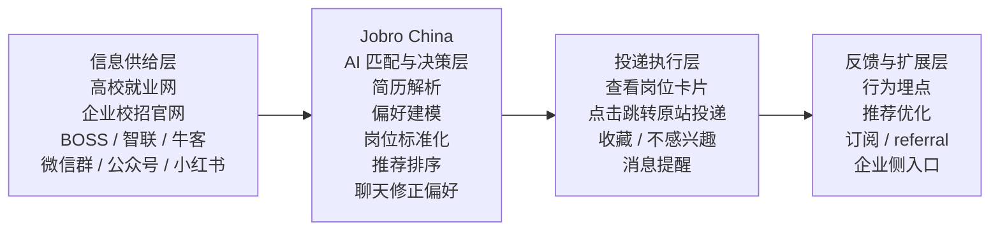
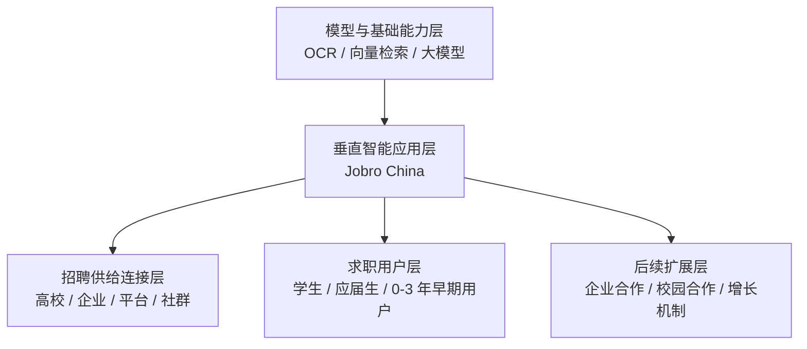

# 提交物 06：预答辩 PPT 大纲 V1

**课程名称：** 硬科技创新创业 (Hard Tech Innovation & Entrepreneurship)  
**项目方向：** 面向中国大陆求职市场的 AI 驱动岗位匹配与职业助手平台（Jobro China）  
**小组成员：** 孙天一、金俊翔、李墨轩  
**日期：** 2026-04-01  
**文档版本：** V1.0

---

## 一、预答辩总策略

根据老师给出的要求，这次预答辩不是“把完整项目缩短讲一遍”，而是要在 **5 分钟内回答 6 个必须回答的问题**：

1. 问题和场景是否真实？
2. 客户与关键角色是否明确？
3. 需求强度和关键指标是否清楚？
4. 现有替代方案及其局限是否分析到位？
5. 我们位于哪一层生态位？
6. 为什么这个切口值得继续推进？

因此建议采用以下原则：

* **先结论，后证据：** 每一页先说一句判断，再给 1 到 2 条证据。
* **先问题，后方案：** 前半段证明“为什么值得做”，后半段再讲“我们怎么做”。
* **每页只支撑一个核心观点：** 不把多个结论塞进同一页。
* **不讲大而全：** 不展开所有功能细节，只保留最关键的判断链。

---

## 二、建议 PPT 结构（8 页）

| 页码 | 标题 | 对应问题 | 建议时长 |
| :--- | :--- | :--- | :--- |
| 1 | 封面 + 一句话结论 | 总起 | 10 秒 |
| 2 | 问题与场景真实存在 | Q1 | 40 秒 |
| 3 | 首批客户与关键角色明确 | Q2 | 25 秒 |
| 4 | 需求强度可以被量化验证 | Q3 | 25 秒 |
| 5 | 现有替代方案很多，但没有解决核心问题 | Q4 | 30 秒 |
| 6 | 证据链说明这是值得进入的赛道 | Q1/Q3/Q4/Q6 | 70 秒 |
| 7 | 我们的生态位与第一落地点清晰 | Q5 | 50 秒 |
| 8 | 为什么继续推进 + 下一步验证计划 | Q6 | 50 秒 |

> 备注：收尾结论可以直接放在第 8 页最后 10 到 15 秒完成，不必再单独拆一页。

---

## 三、逐页大纲

## 第 1 页：封面 + 一句话结论

**页面标题：**  
`Jobro China：面向中国大陆校招/实习场景的 AI 岗位匹配与职业助手`

**这一页只讲一个结论：**  
我们不是要再做一个“大而全招聘平台”，而是做一个帮助学生和应届生在碎片化岗位信息中更快找到可投机会的 **AI 决策与匹配层产品**。

**页面上建议只放 3 行：**

* 项目名
* 小组成员
* 一句话定位：`聚合岗位信息 + 理解用户画像 + 生成可解释推荐`

**口播建议：**  
“我们的项目叫 Jobro China，聚焦中国大陆校招和实习场景。它不是替代 BOSS 或智联，而是在碎片化招聘信息之上，做一个更懂用户的 AI 匹配和职业助手。”

---

## 第 2 页：问题与场景真实存在

**页面标题：**  
`学生和应届生面对的不是“岗位太少”，而是“高质量机会分散且窗口很短”`

**这一页只讲一个结论：**  
中国大陆学生与应届生在求职中面临的是一个真实、高频、重复发生的问题：**岗位来源分散，筛选成本高，短窗口机会容易错过。**

**关键证据只放 2 条：**

* 求职信息分散在高校就业网、企业校招官网、BOSS 直聘、智联招聘、牛客网、微信群、公众号、小红书等多个渠道，用户需要反复搜索和切换。
* 教育部在 2024 年 11 月发布信息指出，**2025 届高校毕业生规模预计达到 1222 万人**，说明校招与实习求职需求本身持续高压、持续存在。

**页面视觉建议：**

* 左边放“一个学生的求职信息流”：高校就业网 / 企业官网 / BOSS / 牛客 / 微信群 / 小红书
* 右边放一句红色结论：`信息不是没有，而是太碎、太快、太难筛`

**口播建议：**  
“我们看到的核心痛点不是简单的就业焦虑，而是求职信息高度碎片化。尤其在校招和实习场景里，机会更新很快，但用户每天要在很多渠道之间来回切换，错过的成本很高。”

---

## 第 3 页：首批客户与关键角色明确

**页面标题：**  
`首批不是服务所有求职者，而是先服务中国大陆校招/实习用户`

**这一页只讲一个结论：**  
首批客户已经明确，我们先做 **中国大陆本科/硕士在校生、应届生、0 到 3 年早期用户中的校招/实习场景**，而不是一开始覆盖全市场。

**页面建议用四角色表述：**

| 角色 | 当前定义 |
| :--- | :--- |
| 使用方 | 本科生、硕士生、应届生、校招实习求职者 |
| 预算方 | 首版以 C 端个人付费为主，使用者和付费者基本是同一人 |
| 集成方 | 首版尽量不依赖学校或企业系统深度对接，以公开岗位页和人工导入为主 |
| 运维方 | Jobro 团队负责岗位库维护、推荐策略、埋点分析与用户支持 |

**这一页想传达的隐含判断：**

* 这是一个 **先做 C 端验证、再考虑 B 端延展** 的路径。
* 我们刻意避开了前期最重的系统集成和销售链路。

**口播建议：**  
“我们没有把客户定义成‘所有求职者’，而是先收缩到校招和实习。这样客户、付费方和使用方都更明确，产品前期也不需要重系统集成，更适合课程周期内做出可验证 MVP。”

---

## 第 4 页：需求强度可以被量化验证

**页面标题：**  
`这个需求不是主观感觉，而是可以用效率和转化指标衡量`

**这一页只讲一个结论：**  
Jobro 要解决的不是泛泛的“体验提升”，而是可以被量化的 **信息发现效率问题和匹配有效性问题**。

**建议只放 4 个指标：**

* `24 小时内拿到首批可投岗位`
* `Activation > 70%`
* `Match Acceptance > 15%`
* `Week-4 Retention > 30%`

**页面下方加一行解释：**

* 对用户：降低筛选时间与错过机会的风险
* 对产品：验证推荐是否真的有价值，而不是“看起来很智能”

**口播建议：**  
“我们把需求拆成了可以验证的指标，比如用户注册后 24 小时内能不能拿到首批岗位，推荐岗位里有多少会被接受，用户到了第 4 周是否还愿意继续留下。这样就能判断我们解决的是不是真问题。”

---

## 第 5 页：现有替代方案很多，但没有解决核心问题

**页面标题：**  
`替代方案不是没有，而是都只解决了局部问题`

**这一页只讲一个结论：**  
今天的替代方案已经很多，但它们要么只做 **职位发布**，要么只做 **信息聚合**，要么只做 **社区讨论**，还没有很好解决“跨来源、可解释、可持续学习”的个性化匹配问题。

**建议把替代方案分成 4 类：**

| 类别 | 代表 | 局限 |
| :--- | :--- | :--- |
| 综合招聘平台 | BOSS 直聘、智联招聘、前程无忧 | 岗位多，但更多依赖静态标签与关键词筛选 |
| 校招/求职社区 | 牛客网、实习僧 | 信息密集，但仍需要用户自己大量筛选 |
| 官方/校园渠道 | 24365、各高校就业网、企业校招官网 | 信息权威，但入口分散、跨源体验差 |
| 私域/手工路径 | 微信群、公众号、小红书、Excel 整理 | 时效高，但结构化差、难以持续跟踪 |

**页面右下角建议加一句：**  
`所以我们的机会不是“再造一个招聘网站”，而是补上匹配与决策这一层。`

**口播建议：**  
“我们认真看了现有方案，发现不是没人做招聘，而是大家都在不同环节各自解决一部分问题。真正缺的是一个能跨多个来源理解用户、解释推荐理由、并随着反馈持续学习的匹配层。”

---

## 第 6 页：证据链说明这是值得进入的赛道

**页面标题：**  
`供给已经很大，政策持续推进，技术窗口也已经出现`

**这一页只讲一个结论：**  
这个方向值得继续推进，因为它同时具备 **真实需求、充足供给、政策支持、技术可行** 四条证据链。

**页面建议做成“四段证据链”：**

### 证据 1：需求规模持续存在

* 教育部 2024-11-14/15 公布信息显示，**2025 届高校毕业生规模预计 1222 万人**，求职压力仍然是长期问题。

### 证据 2：岗位供给已经非常丰富，但不等于用户能高效找到

* 教育部在 2025-07-02 披露，国家大学生就业服务平台已面向 2025 届毕业生 **累计举办线上专场招聘 111 场，汇集发布共享岗位超 1900 万个**。
* 这说明真正的瓶颈不是“岗位绝对数量不足”，而是 **用户如何在海量供给里快速定位适合自己的机会**。

### 证据 3：现有基础设施已经在推动聚合，但个性化决策仍然不足

* 24365 平台本身已经聚合职位信息、专场招聘、实习岗位、联合招聘，甚至与多家社会招聘机构协同。
* 这恰好说明：**聚合正在发生，但深度个性化、持续偏好学习和推荐解释仍有产品空间。**

### 证据 4：技术路线已经具备 MVP 可行性

* 你们当前方案中的 `简历解析 + 偏好表单 + 岗位标签化 + 混合匹配 + 聊天更新偏好` 已经可以在课程周期内做出 P0 版本。
* 大模型让岗位描述理解、简历结构化和推荐理由生成的工程门槛明显下降。

**口播建议：**  
“我们判断这是一个值得进入的方向，不是因为它看起来热，而是因为证据链比较完整。需求是真实的，岗位供给是充足的，官方平台说明市场在持续推进，就连技术实现也已经可以从课程级 MVP 做起。”

---

## 第 7 页：我们的生态位与第一落地点清晰

**页面标题：**  
`Jobro 站在招聘信息供给之上的“AI 匹配与决策层”`

**这一页只讲一个结论：**  
我们不做模型底座，不做招聘系统部署，也不直接重做招聘平台；我们位于 **数字工具层中的垂直智能应用层**，具体是“招聘信息供给之上的 AI 匹配与决策层”。

**建议画一张 4 层图：**

1. **信息供给层**  
高校就业网 / 企业官网 / BOSS / 智联 / 牛客 / 社群

2. **Jobro：匹配与决策层**  
简历解析 / 偏好建模 / 岗位标准化 / 推荐排序 / 聊天修正偏好

3. **投递执行层**  
跳转原站投递 / 收藏 / 不感兴趣 / 提醒

4. **后续可扩展层**  
付费订阅 / referral / 企业侧入口 / 校园渠道合作

**第一落地点要明确写出来：**

`第一 Beachhead：校招/实习中的知识型岗位，优先服务数字化程度高、信息焦虑强、岗位更新快的学生与应届生`

**为什么从这里切入：**

* 痛点最集中
* 用户在线化程度高
* 岗位结构相对标准化
* 更容易在课程周期内拿到反馈闭环

**口播建议：**  
“这是这轮预答辩里最重要的升级点。我们不是泛泛地说‘想做 AI 求职’，而是明确自己站在价值链的哪一层。我们的生态位是招聘供给之上的匹配与决策层，第一落地点则是校招和实习里的知识型岗位。”

---

## 第 8 页：为什么继续推进 + 下一步验证计划

**页面标题：**  
`Why Now + Why Us + 下一步怎么验证`

**这一页只讲一个结论：**  
这个项目值得继续推进，因为现在正好同时满足 **需求高压、技术可做、切口可收缩、团队能执行** 四个条件。

**页面建议分成三栏：**

### Why Now

* 毕业生规模高位运行，校招与实习机会持续密集发布
* 官方平台与社会招聘平台都在推进岗位归集，但“用户决策效率”问题仍未被很好解决
* 大模型让简历理解、岗位理解和偏好学习在 MVP 阶段就具备可行性

### Why Us

* 小组已经完成方向收敛，MVP 边界比之前清晰
* 团队分工互补：沟通调研、整合推进、技术实现三类能力都有基本覆盖
* 当前方案已经把功能收敛到 `简历解析 + 偏好采集 + 岗位推荐 + 聊天修正` 的最小链路

### Validation Plan

* **验证 1：岗位源可用性**  
先用高校就业网、企业校招页、人工导入 Excel 建立首版数据库
* **验证 2：首轮用户闭环**  
招募一批校招/实习用户，验证 24 小时首批推荐是否成立
* **验证 3：推荐有效性**  
重点看 `Activation`、`Match Acceptance`、`不感兴趣反馈后的修正效果`
* **验证 4：合规边界**  
按个人信息保护法、算法推荐管理规定、网络招聘服务管理规定收敛数据和推荐逻辑

**最后一句收束建议直接写在页底：**  
`结论：Jobro China 适合作为一个从明确场景切入、可快速验证、可逐步扩展的课程项目继续推进。`

**口播建议：**  
“我们认为这个项目值得继续推进，因为它不是一个空泛的大方向，而是一个已经完成切口收缩、技术链路清晰、验证步骤明确的课程级项目。接下来我们不是继续发散，而是去验证岗位来源、首批用户和匹配效果。”

---

## 四、如果老师追问，优先准备这 4 个问题

### 1. 你们和 BOSS 直聘到底有什么差别？

**建议回答：**  
我们不想取代综合招聘平台，而是针对学生与应届生场景，做跨来源岗位聚合后的 AI 匹配和职业助手，重点解决的是“筛选效率”和“偏好持续学习”。

### 2. 为什么不直接做企业端或学校端？

**建议回答：**  
因为那会带来更长的销售和集成链路。课程周期内，先做 C 端工具更容易完成需求验证；如果后续成立，再考虑高校就业中心或企业端合作。

### 3. 你们怎么证明不是一个普通套壳 AI 应用？

**建议回答：**  
难点不在聊天界面本身，而在 `岗位标准化 + 用户画像结构化 + 匹配排序 + 反馈闭环` 这条链路是否能跑通，这也是我们 MVP 要验证的核心。

### 4. 为什么第一步不做“所有求职者”？

**建议回答：**  
因为市场太大，首版如果不聚焦，岗位来源、用户需求、推荐逻辑都会发散。校招/实习场景更适合形成高密度反馈。

---

## 五、可直接放到 PPT 末页的总结句

可以直接从下面 3 句里选 1 句作为最后收束：

* `我们要做的不是另一个招聘网站，而是一个站在多源岗位信息之上的 AI 匹配与决策层。`
* `Jobro China 的第一步不是覆盖整个求职市场，而是先把中国大陆校招/实习用户的高频痛点做深。`
* `这个项目值得继续推进，不是因为它想象空间大，而是因为它的问题真实、切口清晰、验证路径具体。`

---

## 六、答辩时建议引用的官方材料

以下材料适合作为 PPT 页脚或答辩时的口头出处：

* 教育部，2024-11-15：《做好 2025 届高校毕业生就业创业工作》  
  关键信息：2025 届高校毕业生规模预计达 `1222 万人`  
  https://www.moe.gov.cn/jyb_xwfb/xw_zt/moe_357/2024/2024_zt01/gzbs/202411/t20241115_1163119.html
* 国家大学生就业服务平台（24365）官方站点  
  https://24365.ncss.cn/
* 教育部，2025-07-02：《@2025届高校毕业生 这些招聘信息别错过》  
  关键信息：24365 平台累计举办线上专场招聘 `111 场`，汇集共享岗位 `超 1900 万个`  
  https://www.moe.gov.cn/jyb_xwfb/xw_zt/moe_357/2025/2025_zt21/mtjj/202507/t20250729_1199845.html
* 教育部，2025-07-28 / 2025-07-29：有关高校毕业生就业举措报道  
  关键信息：24365 平台后续更新口径为汇集共享岗位 `超 2000 万个`  
  https://www.moe.gov.cn/jyb_xwfb/xw_zt/moe_357/2025/2025_zt21/mtjj/202507/t20250728_1199655.html
* 教育部，2025-07-28：《教育系统促进高校毕业生就业政策举措及实施成效纪实》  
  关键信息：2025 年 4 月，国家大学生就业服务平台 AI 助手“智慧小业”上线，可提供岗位精准匹配推荐  
  https://www.moe.gov.cn/jyb_xwfb/xw_zt/moe_357/2025/2025_zt21/jyzf/jyzf_gd/202507/t20250728_1199574.html
* 《中华人民共和国个人信息保护法》  
  https://www.npc.gov.cn/npc/c2/c30834/202108/t20210820_313088.html
* 《互联网信息服务算法推荐管理规定》  
  https://www.cac.gov.cn/2022-01/04/c_1642894606364259.htm
* 《网络招聘服务管理规定》  
  https://www.gov.cn/gongbao/content/2021/content_5588822.htm
* BOSS 直聘功能介绍  
  关键信息：官方强调“直接开聊”“精准匹配”  
  https://www.zhipin.com/web/common/protocol/feature-intro.html
* BOSS 直聘公司简介  
  关键信息：官方将自身定义为“直聘模式”的在线招聘平台  
  https://ir.zhipin.com/zh-hans/about-us/company-profile/

---

## 七、直接可用的补全材料

以下内容是为了把这份大纲进一步推进到“可以直接开始做 PPT”的状态。你们可以直接复制到 PPT，也可以据此再压缩。

### 1. 第 6 页正式版证据链

**建议页标题：**  
`为什么这个方向值得继续推进：需求、供给、政策、技术四条证据链已经成立`

**建议页内主结论：**  
我们继续推进 Jobro China，不是因为“AI + 求职”听起来热门，而是因为这个方向已经同时具备真实需求、充足岗位供给、官方平台推进、技术链路可落地四项条件。

**建议做成 4 张证据卡片：**

| 证据卡片 | 建议放到 PPT 上的短句 | 官方出处 | 你们在台上怎么解释 |
| :--- | :--- | :--- | :--- |
| 需求强度 | `2025 届高校毕业生预计 1222 万人，就业压力持续存在` | 教育部，2024-11-15 | 说明校招/实习需求不是短期偶发，而是长期高压市场 |
| 岗位供给 | `24365 平台已累计举办 111 场线上专场招聘，汇集共享岗位超 1900 万个` | 教育部，2025-07-02 | 说明岗位不是没有，而是用户很难从海量供给里快速找到适合自己的机会 |
| 趋势确认 | `2025 年 4 月，24365 平台上线 AI 助手“智慧小业”，开始提供岗位精准匹配推荐` | 教育部，2025-07-28 | 说明连官方就业平台都在往 AI 匹配方向升级，趋势已经非常明确 |
| 技术可行 | `我们的 P0 链路已经收敛为：简历解析 + 偏好表单 + 岗位标签化 + 推荐排序 + 聊天更新偏好` | 你们自己的项目方案 | 说明这个项目不是概念堆砌，而是课程周期内可以跑通的 MVP |

**建议页脚小字：**

`来源：教育部 2024-11-15；教育部 2025-07-02；教育部 2025-07-28；项目组整理`

**如果老师追问“1900 万还是 2000 万？”**

建议直接这样回答：

* `2025-07-02` 的教育部报道口径是 **超 1900 万个**
* `2025-07-28 / 2025-07-29` 的后续报道口径更新为 **超 2000 万个**
* 两者不是冲突，而是 **同一平台在不同时间点的累计更新数据**

**可直接复制到 PPT 的正文版：**

> 第一，需求是真实而且长期存在的。教育部在 2024 年 11 月明确指出，2025 届高校毕业生规模预计达到 1222 万人。  
> 第二，岗位供给也足够大。到 2025 年 7 月，24365 平台已经累计举办 111 场线上专场招聘，汇集共享岗位超过 1900 万个，后续又更新到超过 2000 万个。  
> 第三，官方平台本身也在往智能匹配方向演进。2025 年 4 月，24365 平台上线 AI 助手“智慧小业”，开始提供岗位精准匹配推荐。  
> 第四，从我们自身方案看，这个方向已经具备课程级 MVP 的技术可行性，因此值得继续推进。

### 2. 第 6 页图片方案

#### 方案 A：四证据卡片排版

**画面结构：**

* 白底
* 顶部一个深蓝标题条
* 中间 2 x 2 四张卡片
* 每张卡片包含：`大数字 / 关键词 / 一句解释 / 小字出处`

**四张卡片建议内容：**

* 左上：`1222 万`  
  副标题：`2025 届高校毕业生规模`
* 右上：`111 场`  
  副标题：`24365 线上专场招聘`
* 左下：`1900 万+`  
  副标题：`汇集共享岗位`
* 右下：`AI 匹配`  
  副标题：`官方平台也在升级智能推荐`

**配色建议：**

* 深蓝：`#173B6C`
* 中蓝：`#4C78B5`
* 强调红：`#B42318`
* 浅灰底：`#F5F7FA`

#### 方案 B：详细生图/找图描述

如果你想自己找图或者生成一张信息图，可以按下面这个描述：

`一张学术汇报风格的信息图，白色背景，深蓝色标题，整体是四宫格布局。左上卡片显示“1222万”大数字，代表2025届高校毕业生规模；右上卡片显示“111场”，代表24365线上专场招聘；左下卡片显示“1900万+”，代表共享岗位数量；右下卡片显示“AI匹配”，代表官方平台开始用AI辅助就业服务。每张卡片都使用简洁线性图标：毕业帽、日历招聘会、岗位列表、AI芯片。风格专业、克制、适合大学课程预答辩，不要商业海报感，不要夸张渐变。`

### 3. 第 7 页生态位图

#### 方案 A：Mermaid 价值链图

**这张图的讲法：**  
我们不是自己从零生产所有招聘信息，而是站在已有岗位供给之上，做“理解用户 + 标准化岗位 + 做出推荐 + 吸收反馈”的那一层。

#### 方案 B：Mermaid 生态位定位图

**这张图的讲法：**  
我们不做模型底座，也不先做学校和企业的大型系统部署，而是先做一层垂直智能应用，把基础 AI 能力转化为求职场景里的实际匹配价值。

#### 方案 C：详细生图/找图描述

如果你想自己找图或者生成一张价值链图，可以按下面这个描述：

`一张极简信息架构图，横向四层结构，白底，深蓝和中蓝为主色。最左侧是“信息供给层”，包含高校就业网、企业官网、招聘平台、社群线索四类来源，用四个简洁线框图标表示。中间最重要的一层是“Jobro China AI匹配与决策层”，用一个较大的深蓝色圆角矩形高亮，内部写上简历解析、偏好建模、岗位标准化、推荐排序、聊天修正偏好。右侧是“投递执行层”，包括跳转原站投递、收藏、不感兴趣、消息提醒。最右侧是“反馈与扩展层”，包括行为埋点、推荐优化、订阅、referral、企业侧入口。整体风格像咨询公司汇报页，不要炫酷插画，重点是逻辑清晰、层级明确。`

### 4. 备用页 A：合规风险与边界

**建议页标题：**  
`合规不是“做不了”，而是必须从 Day 1 开始按边界设计`

**这一页的核心结论：**  
Jobro China 在课程项目阶段可以推进，但必须严格围绕 **最小必要、明示同意、推荐透明、投诉可达、许可证边界待核验** 五个原则设计。

**建议放 5 条：**

| 合规点 | 你们应该怎么说 | 依据 |
| :--- | :--- | :--- |
| 最小必要 | 简历、偏好、行为数据只收集完成匹配所必需的内容 | 《个人信息保护法》第 6 条 |
| 明示告知与同意 | 上传简历、保存偏好、使用推荐前，应明确告知处理目的、方式、范围 | 《个人信息保护法》第 14 至 17 条 |
| 推荐透明 | 应告知用户使用了推荐机制，并尽量说明推荐逻辑 | 《算法推荐管理规定》第 16 条 |
| 用户可调整 | 用户应能关闭推荐、调整或删除标签、提交反馈 | 《算法推荐管理规定》第 17 条、第 22 条 |
| 招聘服务边界 | 如果后续产品直接提供网络招聘撮合服务，是否触及人力资源服务许可证要求，需要专项核验 | 《网络招聘服务管理规定》第 9 条；这是基于法规的项目推断 |

**适合放在页脚的小字：**

`来源：中国人大网 2021-08-20；中国网信网 2022-01-04；中国政府网 2021-03-01`

**你们在台上可以这样说：**  
“我们没有把合规理解成最后再处理的法务问题，而是从产品结构一开始就按最小必要和推荐透明来设计。需要特别说明的是，如果后续产品形态从‘岗位聚合与推荐工具’进一步走向直接网络招聘撮合服务，许可证问题需要专项核验。”

### 5. 备用页 B：我们和 BOSS 直聘的差别

**建议页标题：**  
`我们不是“缩小版 BOSS”，而是不同生态位的产品`

**核心结论：**  
BOSS 直聘是综合在线招聘平台，重点是平台内职位供给和求职者与招聘者的直接沟通；Jobro China 则是面向校招/实习用户的 **跨来源 AI 匹配与决策层**。

**建议做成对比表：**

| 维度 | BOSS 直聘 | Jobro China |
| :--- | :--- | :--- |
| 官方定位 | 在线招聘平台，强调“直聊”和平台内匹配 | 课程项目中的垂直智能应用，站在多源岗位信息之上的 AI 匹配层 |
| 目标场景 | 全量招聘市场，覆盖多类岗位和人群 | 先聚焦中国大陆校招 / 实习 / 知识型岗位 |
| 岗位来源 | 平台内职位供给为主 | 高校就业网、企业校招页、公开职位、人工导入等多源输入 |
| 用户核心动作 | 搜索职位、直接开聊、平台内沟通 | 上传简历、收集偏好、接收推荐、修正偏好、跳转原站投递 |
| 核心价值 | 平台撮合效率 | 跨来源筛选效率 + 可解释推荐 + 反馈学习 |
| 我们的边界 | 不替代大型招聘平台 | 先做其上层的匹配与决策工具 |

**补一句更强的回答：**

`如果把招聘看成价值链，BOSS 更像一个大型交易平台；Jobro 更像站在多源供给之上的智能筛选与决策助手。`

**可选小字出处：**

* BOSS 直聘功能介绍页面：强调“直接开聊”“精准匹配”
* BOSS 直聘 IR 公司简介：强调“直聘模式”和在线招聘平台属性

---

## 八、下一步可选优化

如果你们接下来要继续打磨，我建议优先补这三样：

1. 直接把第 6 页和第 7 页做成正式 PPT 初稿，先验证视觉密度是否过高。
2. 把第 8 页再缩成真正的 3 栏结构，避免讲超时。
3. 按本文件的两个备用页准备好答辩时的追问材料。
4. 如果你们愿意，我可以下一步继续把这份文档转换成：
   `每一页可直接复制到 PPT 的正文`
   `5 分钟中文讲稿`
   `答辩 Q&A 速记卡`
