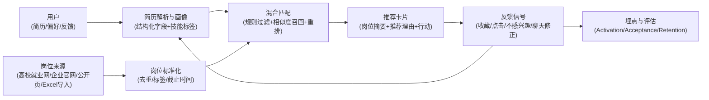

# 提交物 08：项目拟定书 V1（Jobro China）

**课程名称：** 硬科技创新创业 (Hard Tech Innovation & Entrepreneurship)  
**项目方向：** 面向中国大陆求职市场的 AI 驱动岗位匹配与职业助手平台（Jobro China）  
**课程阶段：** 第 5 周 第 10 次课｜项目拟定 II：项目拟定书汇报  
**版本 / 日期：** V1.0 / 2026-04-16  
**团队名称：** Jobro 小组（暂用）  
**团队成员与分工：**

| 成员 | 本轮分工（对齐模板口径） |
| :--- | :--- |
| 孙天一 | 需求与验证、访谈与证据整理、渠道与冷启动调研 |
| 金俊翔 | 产品边界与价值主张、竞品与替代方案对比、答辩叙事与材料整合 |
| 李墨轩 | 技术路线与 MVP 实现、数据与匹配流程设计、合规注意点梳理 |
| 王锡葵 | 资源整合（岗位来源协同、外部对接与资料/渠道支持） |

**一句话概述：** 面向中国大陆校招/实习学生，在多渠道岗位信息碎片化且窗口短的场景中，利用“简历解析 + 偏好建模 + 岗位聚合 + 混合匹配 + 可解释推荐 + 提醒闭环”，优先改善 `24h 内获得首批可投岗位` 与 `Match Acceptance` 等指标。

---

## 1. 项目概述（80—120 字）

本项目面向中国大陆校招/实习学生，在岗位信息分散（高校就业网、企业校招官网、招聘平台、社群等）且机会窗口短的求职场景中，针对“高质量机会难发现、筛选成本高、容易错过截止时间”的问题，采用“简历解析 + 偏好采集 + 岗位标准化 + 混合匹配与可解释推荐 + 提醒闭环”的方案，优先改善 `24h 内首批可投岗位` 与 `Match Acceptance`。

---

## 2. 问题与第一场景

| 栏目 | 结论版填写 |
| :--- | :--- |
| 目标角色 | 中国大陆本科/硕士在校生、应届生（优先校招/实习场景） |
| 第一场景 | 秋招/春招/暑期实习窗口期，学生每天在多个渠道反复刷新岗位并筛选，容易错过短窗口机会 |
| 当前流程（真实流程 3—5 步） | 1) 打开多个渠道浏览岗位（就业网/企业官网/BOSS/牛客/微信群等）；2) 复制链接到收藏夹/表格/备忘录；3) 反复比对要求与个人情况并做筛选；4) 发现信息不全再回到原站补查；5) 手动设置提醒或完全忘记截止时间 |
| 核心痛点（1—2 个） | 痛点 1：岗位信息碎片化导致筛选成本高且重复劳动多；痛点 2：更新节奏快、截止时间短，错过机会的成本高 |
| 现有替代方案 | 综合招聘平台（BOSS/智联/51job）、校招/求职社区（牛客/实习僧）、官方与校园渠道（24365/高校就业网/企业官网）、私域手工路径（微信群/公众号/小红书/Excel 整理） |

---

## 3. 关键证据与需求验证摘要

当前仓库已完成方向收敛与调研入口设计，但“用户证据”仍需通过访谈补齐。本节仅保留对边界与路线最关键的证据与待补证据。

| 证据来源 | 关键信息（当前已知/待补） | 对当前方案的影响 |
| :--- | :--- | :--- |
| 访谈 / 观察 | 已形成访谈对象与问题设计（计划 8—10 人，覆盖学生/应届/就业老师/信息整理者）。 | 用于最终确认：首批用户边界、第一场景叙述、提醒通道优先级、是否接受“AI 推荐 + 聊天修正偏好”。 |
| 二手资料 / 官方平台 / 合规文件 | 已明确需要梳理个人信息保护与算法推荐合规（简历上传、画像、推荐解释），并以官方渠道（教育部/人社等）为优先信息源。 | 将约束数据采集方式、用户授权与解释机制，影响“岗位来源”与“产品形态”取舍。 |
| 替代方案对比 | 现有方案各自解决局部问题，但仍普遍把“跨来源筛选与决策”留给用户手工完成。 | 支撑 Jobro 的生态位：不重造招聘平台，而做“供给之上的匹配与决策层”，先把聚合、筛选、提醒做成闭环。 |

---

## 4. 客户与价值主张

面向**校招/实习学生**在**多渠道岗位发现与筛选**场景中，由于现有替代方案（招聘平台/社区/就业网/社群）存在“信息分散、筛选重复、窗口短易错过”的问题，我们用“简历解析 + 偏好建模 + 跨来源岗位标准化 + 可解释推荐 + 提醒闭环”的方式，优先把 `首次可投岗位清单获取时延` 改善到 `24h 内`，并把 `Match Acceptance` 提升到 `> 15%`（以“推荐岗位被收藏/点击投递/标记感兴趣”为近似判据）；本轮将通过**小样本真实用户试用 + 对照筛选任务**进行验证。

---

## 5. 项目边界与“不做清单”

| 边界项 | 本轮结论 | 备注 |
| :--- | :--- | :--- |
| 先服务谁 | 校招/实习的本科/硕士学生（优先信息焦虑强、更新节奏快的方向） | 不泛化到“所有求职者” |
| 先解决什么 | “跨来源岗位发现与筛选”效率问题（先让用户更快拿到可投清单） | 只保留 1 个主问题 |
| 先验证什么 | `24h 内首批可投岗位` 与 `Match Acceptance` | 可测、可展示、可解释 |
| 本轮明确不做（至少 3 项） | 1) 不做全量招聘平台与投递闭环（课程期内无法覆盖供需两侧与履约）；2) 不做大规模自动抓取与再分发（合规风险高、工程成本高）；3) 不做“简历代写/一键海投”类功能（风险高且偏离本轮主问题）；4) 不做企业 ATS 集成（外部依赖重，影响可控性）。 | 每项以“可控性、合规、课程期交付”为取舍理由 |

---

## 6. MVP 定义

| 栏目 | 本轮填写 |
| :--- | :--- |
| MVP 形式 | 可演示的 Web 原型 + 小规模岗位库 + 可解释推荐卡片（必要时用人工导入支撑） |
| 最小主链路（至少 4 步） | 1) 用户注册并上传简历/填写偏好；2) 系统解析简历并生成初始画像；3) 导入/维护岗位库并完成标准化与标签化；4) 规则过滤 + 相似度召回 + 重排生成推荐；5) 输出推荐卡片与推荐理由；6) 用户反馈（感兴趣/不感兴趣/收藏/点击投递）并更新偏好；7) 记录关键埋点用于评估 |
| 最小功能集（2—4 个） | 简历上传与解析、偏好采集、岗位推荐卡片（含推荐理由）、反馈闭环（不感兴趣/更偏好某类） |
| 关键指标（带判据） | `24h 内首批可投岗位`；`Activation > 70%`（完成简历+偏好并查看推荐）；`Match Acceptance > 15%`；`Week-4 Retention > 30%`（若时间允许做连续观测） |
| 课程期内完成标准 | 至少导入 200 条岗位；可对 10 名以内用户产生可解释推荐并收集反馈；答辩可现场演示主链路与核心指标口径 |

---

## 7. 技术路线与系统框架

**关键技术假设：** 在冷启动数据有限的情况下，通过“规则过滤 + 标签/向量召回 + 大模型辅助重排与解释”的混合路线，可以在小样本岗位库中稳定产出用户可接受的推荐，并通过反馈逐步收敛偏好。

**验证节点：** 在“推荐结果产出”与“用户反馈回流”两处设置可观察验证：推荐是否被接受（Acceptance），偏好是否能被快速纠正并带来下一轮推荐提升。

---

## 8. TRL 评估表

| 项目 | 本轮填写 |
| :--- | :--- |
| 当前 TRL | TRL3（概念验证阶段） |
| 支撑当前判断的证据（至少 2 条） | 1) 已完成项目方向、用户痛点与 MVP 功能范围定义；2) 已形成调研入口、合规关注点与访谈计划；3) 已有可用于演示的前端原型雏形（仓库中 `Jobro` 原型工程）。 |
| 目标 TRL | TRL4—5（课程期内做出可演示原型并在小样本场景下验证） |
| 关键跃迁任务（2—4 条） | 1) 跑通“简历解析 → 画像 → 推荐卡片”的最小链路；2) 建立小规模岗位库与标准化流程；3) 打通反馈闭环与关键埋点；4) 完成 8—10 人访谈与 5—10 人试用验证。 |
| 达成判断口径 | 可现场演示：用户完成输入后 24h 内得到首批推荐；推荐有可解释理由；能收集反馈并在下一轮推荐中体现偏好修正；形成指标记录与复盘。 |

---

## 9. 可行性分析表

| 维度 | 有利条件 / 已具备 | 短板 / 约束 | 补救动作 |
| :--- | :--- | :--- | :--- |
| 技术可行性 | 混合匹配路线可用规则与向量检索先跑通；已有前端原型雏形可承载演示；可用开源/OCR/LLM 组件做简历理解与解释生成。 | 冷启动数据少导致推荐不稳定；简历解析质量波动；岗位标准化成本高。 | 先聚焦知识型岗位与少量城市；以人工导入保障数据质量；采用可解释规则基线做对照。 |
| 资源可行性 | 校园内可招募学生用户；岗位可从公开来源与人工整理表格获取；团队有基本开发能力。 | 合规边界与“可用岗位来源”需要更谨慎；高质量岗位池需要持续维护。 | 优先用“公开页链接+摘要”而非全量再分发；明确用户授权与数据最小化；设定岗位库维护责任人与节奏。 |
| 时间可行性 | 已有阶段计划与 MVP 边界（P0 优先）。 | 课程周期短，需求、数据、工程并行风险高。 | 以“主链路可演示”为唯一优先级；非关键功能延后；每周固定评审一次边界与指标。 |
| 合规 / IP 可行性 | 已识别关键合规主题：个人信息保护、算法推荐解释、岗位来源再分发风险。 | 若采集与再分发边界不清，容易引发合规风险；用户简历属于敏感个人信息。 | 明确告知与授权、支持删除；默认最小化存储；推荐理由不暴露敏感信息；岗位以原站跳转为主。 |

---

## 10. 验证计划与关键指标

| 关键假设 | 验证方式 | 关键指标 / 判据 | 责任人 / 时间 |
| :--- | :--- | :--- | :--- |
| H1：用户的核心痛点是“信息碎片化+窗口短”，愿意为更快筛选付出输入成本（简历/偏好） | 8—10 人半结构化访谈 + 任务回放（让用户复盘最近一次找岗位路径） | 访谈中超过半数明确提到“多渠道切换/错过截止/重复筛选”为高痛点；且愿意尝试上传简历或填偏好换取推荐 | 孙天一 / 2026-04-16 至 2026-04-20 |
| H2：混合匹配在小岗位库下仍能产出“可接受推荐”，解释提升信任 | 小规模岗位库（>=200）+ 5—10 人试用 + 对照（无解释 vs 有解释） | `Match Acceptance > 15%`；解释版本的主观信任评分高于无解释版本（访谈量表/打分即可） | 李墨轩 / 2026-04-18 至 2026-04-25 |
| H3：提醒通道决定留存与价值感，微信生态或站内提醒是首选 | 访谈偏好统计 + 原型内 A/B（不同提醒入口文案与频率） | 至少 60% 受访者明确选择 1 种主提醒方式；提醒后 24h 内回访率有可观察提升 | 金俊翔 / 2026-04-18 至 2026-04-25 |

---

## 11. 风险清单与对策

| 风险来源 | 概率 / 影响 | 预警信号 | 缓解措施 |
| :--- | :--- | :--- | :--- |
| 技术风险 | 中 / 中 | 推荐结果不稳定，Acceptance 长期低于 10%；解析错误导致画像偏差 | 保留规则基线与可解释过滤；缩窄岗位方向与城市；用人工校验小数据提升信号质量 |
| 资源风险 | 中 / 中 | 岗位库质量差、重复多、截止时间缺失；岗位维护跟不上 | 先用“高质量人工导入 + 少量来源”跑通；定义岗位标准字段与去重规则；固定每周维护节奏 |
| 进度风险 | 中 / 高 | P0 主链路无法演示或联调拖延 | 明确唯一优先级：主链路可演示；P1/P2 功能延后；每 2 天做一次可演示版本验收 |
| 团队协作风险 | 低 / 中 | 任务接口不清导致返工 | 以“输入/输出契约”划分接口；每周例会同步里程碑与风险；关键模块指定单一 owner |
| 外部依赖风险（合规/渠道） | 中 / 高 | 发现岗位来源不可用或再分发风险高；用户对隐私敏感拒绝上传简历 | 以“原站跳转+摘要”降低再分发风险；提供匿名/最小输入路径；明确授权与删除机制；提前准备替代数据与离线演示方案 |

---

## 12. 团队分工与下一阶段任务

| 成员 / 角色 | 本轮负责内容 | 下阶段首要任务 |
| :--- | :--- | :--- |
| 孙天一 / 需求验证 | 访谈招募、访谈执行、证据整理、渠道地图与冷启动建议 | 完成 8—10 人访谈并输出共性结论；确定首批用户边界与提醒偏好 |
| 金俊翔 / 产品与整合 | 价值主张、竞品矩阵、答辩材料一致性、指标口径 | 固化“第一场景 + 指标 + 不做清单”；产出 PPT 压缩版本结构 |
| 李墨轩 / 技术实现 | MVP 主链路实现、岗位库与标准化、匹配策略与解释、埋点 | 跑通“简历 → 画像 → 推荐 → 反馈”闭环；完成小数据对照验证与演示脚本 |
| 王锡葵 / 资源整合 | 岗位来源与资源对接、外部协作支持、资料与渠道补齐 | 匹配效果调试（协助构建对照样本、问题归因与参数/规则调优） |

---

## 附：本拟定书与仓库材料的对应关系（便于追溯）

| 本拟定书章节 | 主要依据材料 |
| :--- | :--- |
| 项目方向与 MVP | `04_Project_Preliminary_Plan.md` |
| 调研与合规关注点 | `05_Search_Queries_and_Research_Assignment_v1.md` |
| 预答辩叙事与指标口径 | `06_Pre_Defense_PPT_Outline_v1.md` |
| 访谈对象与问题 | `07_User_Interview_Plan_v1.md` |
